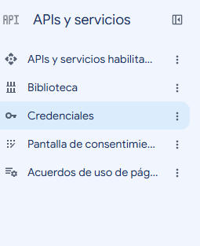

# Generar Clave de API de Gemini en Google Cloud Platform (GCP)

Esta guía documenta los pasos necesarios para generar una clave de API (API Key) en Google Cloud Platform (GCP) para utilizar el modelo de lenguaje Gemini. Esta clave es genérica y puede ser utilizada en cualquier backend, scripts propios o plataformas de automatización como n8n.

## Requisitos Previos

- Una cuenta de Google con acceso a [Google Cloud Console](https://console.cloud.google.com/).
- El entorno o servicio donde la vayas a implementar (ej. servidor propio, n8n, etc.).

## Paso 1: Configurar el Proyecto en GCP

1. Accede a la [Consola de Google Cloud](https://console.cloud.google.com/).
2. Haz clic en el selector de proyectos en la parte superior de la pantalla.
3. Selecciona **Proyecto nuevo** (New Project).
4. Asigna un nombre al proyecto (ej. `gemini-api-project`) y selecciona la organización/ubicación correspondiente.
5. Haz clic en **Crear**.

## Paso 2: Habilitar la API de Gemini

1. Asegúrate de tener seleccionado el proyecto que acabas de crear.
2. En el menú de navegación izquierdo, ve a **API y servicios > Biblioteca** (APIs & Services > Library).
3. En el buscador, ingresa **"Gemini API"** (internamente su servicio es `generativelanguage.googleapis.com`).
4. Selecciona **Gemini API** y haz clic en el botón azul **Habilitar**.

## Paso 3: Generar la Clave de API (API Key)

1. En el menú izquierdo de GCP, ve a **API y servicios > Credenciales** (APIs & Services > Credentials).
   
   

2. Haz clic en **+ CREAR CREDENCIALES** (+ CREATE CREDENTIALS) en la parte superior.
3. Selecciona **Clave de API** (API key).
4. Es posible que Google te muestre un formulario de configuración antes de crearla. Si es así, configúralo de la siguiente manera:
   - **Restricciones de aplicaciones:** Si tu servidor tiene una IP estática, selecciona **Direcciones IP** e ingresa la IP pública de tu servidor **agregando el sufijo `/32` al final** (ej. `192.168.1.50/32` que indica una única IP exacta). Esto es muy recomendado por seguridad. Si vas a probar desde múltiples lugares y no tienes IP fija, selecciona **Ninguno**. *(Evita usar "Sitios web" si te vas a conectar desde un backend o herramienta como n8n).*
   - **Restricciones de API:** Elige **Gemini API**.
   - **Cuenta de servicio:** Google requiere vincular la clave a una cuenta de servicio. Haz clic en **+ Seleccionar una cuenta de servicio**. Si tienes una cuenta por defecto, selecciónala. Si la lista está vacía, haz clic en **"Crear una cuenta nueva"**, asígnale un nombre descriptivo (ej. `gemini-api-sa`) y guárdala.
5. Haz clic en el botón azul **Crear** y **Copia el valor de la clave** generada.

## Ejemplo de uso: Configuración de la Credencial en n8n

1. Abre la interfaz web de tu instancia de n8n.
2. En el menú lateral, ve a la sección **Credentials** (Credenciales).
3. Haz clic en **+ Add Credential** (+ Agregar Credencial).
4. En el buscador, busca y selecciona **Google Gemini API**.
5. Asigna un nombre a la credencial (ej. `Google Gemini GCP`).
6. Pega la clave de API que copiaste en el paso 3 en el campo correspondiente.
7. Haz clic en **Save** (Guardar).

## Paso 5: Utilizar Gemini en un Flujo

1. Ve a **Workflows** y crea un flujo nuevo.
2. Añade el nodo **Google Gemini**.
3. En la configuración del nodo, selecciona la credencial que acabas de crear.
4. Elige el recurso (ej. `Message`) y la operación a realizar.
5. Define el modelo (ej. `gemini-1.5-flash`) y el texto o mensaje (prompt).
6. Ejecuta el nodo de prueba para comprobar que la conexión funciona correctamente y obtienes la respuesta de Gemini.
